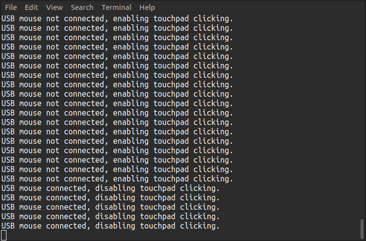

# USB Mouse Touchpad Click Toggle

This project provides a Python script that automatically enables or disables the touchpad's tap-to-click functionality based on whether a USB mouse is connected. When a USB mouse is connected, tap-to-click on the touchpad is disabled to avoid accidental clicks. When the mouse is disconnected, tap-to-click is re-enabled for ease of use.

The script runs in the background, checking every second for the status of the USB mouse and adjusting the touchpad's click behavior accordingly.



## Features

- Detects when a USB mouse is connected or disconnected.
- Disables tap-to-click functionality on the touchpad when a USB mouse is connected.
- Re-enables tap-to-click functionality when the USB mouse is disconnected.
- Runs continuously, checking the mouse connection status every second.

## Requirements

- **Linux** operating system (tested on Ubuntu/Debian-based systems).
- **Python 3** (tested with Python 3.10.12).
- **xinput**: A utility to configure and manage input devices (used for managing touchpad and pointer device settings).
- **poetry**: A dependency manager and tool for packaging Python projects (used for managing project dependencies and environment).

## Installation

1. Clone this repository to your local machine:

   ```bash
   git clone https://github.com/amhoba2014/usb-mouse-touchpad-click-toggle
   cd usb-mouse-touchpad-click-toggle
   ```

2. Install the required dependencies:

   ```bash
   poetry install
   ```

3. **Initial Setup**: The first time you run the script, it will automatically perform setup if the `.env` file is not present. This setup will guide you through selecting your USB mouse and touchpad devices and the specific property used to toggle tap-to-click functionality. Once completed, this configuration will be saved to a `.env` file for future use.

4. Run the main script:

   ```bash
   poetry run python main.py
   ```

## Usage

### Automatic Setup

If the `.env` file is not found when the script is run, the setup process will be triggered automatically. This will guide you through the following steps:

- **Select USB Mouse Device**: Choose the USB mouse from a list of connected pointer devices.
- **Select Touchpad Device**: Choose the touchpad device.
- **Select Tap-to-Click Property**: Choose the property that enables or disables tap-to-click functionality on the touchpad.

These selections will be saved in the `.env` file for future runs.

### Running the Script

After the initial setup, run `main.py` as shown above. The script will monitor the USB mouse connection and automatically toggle the touchpad tap-to-click functionality:

- If the USB mouse is connected, tap-to-click on the touchpad is **disabled**.
- If the USB mouse is disconnected, tap-to-click is **enabled**.

You can stop the script by pressing `CTRL + C` in the terminal.

## Restarting Setup Process

If you wish to manually retrigger the setup process, you can remove the `.env` file and run the script again:

```bash
rm .env
poetry run python main.py
```

This script will guide you through selecting the devices and properties needed for configuration again and the `.env` file will be created accordingly.

## Todo

Enhance the script to handle device events by actively listening for USB mouse connection and disconnection events. This improvement would eliminate the need for polling and repeatedly parsing the xinput device list.

## License

This project is licensed under the MIT License. See the [LICENSE](LICENSE) file for more details.

## Contributing

Contributions are welcome! Feel free to fork the repository, make your changes, and submit a pull request.
